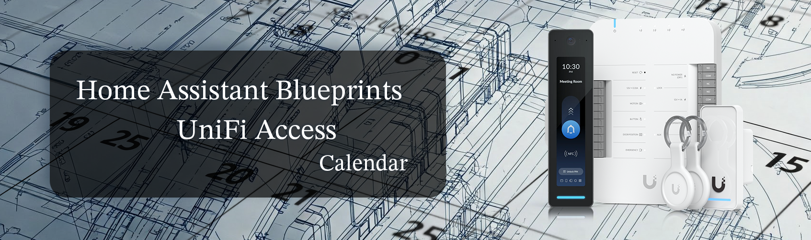

  

# Unifi Access Door Control Suite

### ⚠️ DISCLAIMER: READ BEFORE USE
**This software controls physical access and security mechanisms.**
By using these blueprints, you acknowledge that you are solely responsible for the configuration, testing, and monitoring of your security system. The authors and contributors of this repository are **not responsible** for any unauthorized access, failure to lock, physical theft, property damage, or safety incidents resulting from the use, misuse, or failure of these automations.
* Always maintain a manual key or alternative entry method.
* Test all emergency lockdown procedures regularly.
* Ensure your Home Assistant instance is on a UPS (Battery Backup) and has a stable network connection.
* **USE AT YOUR OWN RISK.**

---

## 🤝 Required Integration & Credits

**This project would not be possible without the work of the community.**

To use these blueprints, you **must** install the **Unifi Access Custom Integration**. This suite relies entirely on the entities exposed by this integration to control your doors.

* **Repository:** [imhotep/hass-unifi-access](https://github.com/imhotep/hass-unifi-access)
* **Installation:** Install via HACS (Home Assistant Community Store).

**Note:** This automation suite functions only as long as the underlying integration is maintained and remains compatible with current versions of Unifi OS and Home Assistant. A huge thank you to the creators and maintainers of `hass-unifi-access` for making this possible!

---

## 📖 Overview
This suite of Home Assistant blueprints is designed to automate **Unifi Access** locks using **Google Calendar**. It transforms a simple schedule into a smart access system that handles:
* **Smart Unlocking:** Opens doors before events start.
* **Smart Locking:** Closes doors after events end (but waits if another event is starting soon).
* **Safety Net:** Periodically checks for missed locks or canceled events.
* **Night Mode:** Completely disables unlocking schedules overnight for security.
* **Emergency Lockdown:** Instantly overrides schedules and locks doors during an emergency.

---

## 📂 The Blueprint Files

| File Name | Display Name | Function |
| :--- | :--- | :--- |
| `scheduler_01_unlock.yaml` | **Scheduler: Unlock Door** | **The Opener.** Unlocks the door before an event starts (e.g., 30 mins prior). Checks for "Canceled" keywords to prevent false unlocks. |
| `scheduler_02_lock.yaml` | **Scheduler: Lock Door** | **The Closer.** Locks the door after an event ends. Uses a **Look-Ahead Buffer**—it will *not* lock if another meeting starts soon. |
| `safety_01_sweeper.yaml` | **Safety: Periodic Sweep** | **The Janitor.** Runs every 15 minutes. Locks the door if it finds it unlocked with **no active event** or a **canceled event**. |
| `safety_02_night_shutdown_morning_startup.yaml`| **Safety: Shutdown & Startup** | **The Night Manager.** At night (e.g., 10 PM), it locks doors and **turns off** the Unlock Scheduler. In the morning (e.g., 5:30 AM), it turns it back on. |
| `safety_03_lockdown_and_recovery.yaml` | **Safety: Lockdown & Recovery** | **The Emergency Manager.** Disables all schedules and forces a hard lock when Unifi reports an emergency. Restores normal operation via a manual Reset Button. |

---

## ⚙️ Prerequisites (Create these first!)

Before importing the blueprints, you must create the following **Helpers** in Home Assistant (`Settings` -> `Devices & Services` -> `Helpers`).

### 1. The Keyword (Input Text)
Used to filter which calendar events unlock the door.
* **Type:** Input Text
* **Name:** `Door Keyword` (e.g., `input_text.door_keyword`)
* **Value:** `*` (or your preferred keyword).
* *Note: The blueprints automatically trim invisible spaces to prevent errors.*

### 2. The Reset Button (Input Button)
Used to tell the system "The Emergency is Over" after a lockdown.
* **Type:** Button
* **Name:** `System Reset - All Clear`
* **Icon:** `mdi:restart-alert`

---

## 🚀 Setup & Configuration Guide

### 1. Configure the Unlocker (`scheduler_01_unlock.yaml`)
* **Trigger:** Event Start
* **Unlock Offset:** Set to `-00:30:00`.
    * *Meaning:* The door unlocks 30 minutes **before** the calendar start time.
* **Keyword:** Select your `input_text.door_keyword`.
* **Safety:** It will **not** unlock if the event title contains "Canceled" or "Cancelled".

### 2. Configure the Locker (`scheduler_02_lock.yaml`)
* **Trigger:** Event End
* **Lock Offset:** Set to `00:05:00` (5 minutes).
    * *Meaning:* Waits 5 minutes after the meeting ends to allow people to leave.
* **Look Ahead Buffer:** Set to `00:20:00` (20 minutes).
    * *Meaning:* Before locking, the system checks the calendar. If the **next** meeting starts in less than 20 minutes, it stays unlocked.

### 3. Configure Night Mode (`safety_02_night_shutdown_morning_startup.yaml`)
This prevents accidental unlocks during the night (e.g., if a calendar event is set for 3 AM by mistake).
* **Shutdown Time (Night):** Set to `22:00:00` (10:00 PM).
    * At this time, the door locks and the "Unlock Scheduler" is turned **OFF**.
* **Startup Time (Morning):** Set to `05:30:00` (5:30 AM).
    * At this time, the "Unlock Scheduler" is turned back **ON**.
    * *Tip:* Set this time at least 30 minutes before your earliest possible event.

### 4. Configure Lockdown & Recovery (`safety_03_lockdown_and_recovery.yaml`)
* **Unifi Sensor:** Select the binary sensor from Unifi Access that indicates a lockdown (e.g., `binary_sensor.unifi_lockdown`).
* **Reset Button:** Select the `System Reset - All Clear` button you created in the prerequisites.
* **Automations to Manage:** Select **ALL** automations you want to disable during an emergency.
    * *Recommended:* Select `Scheduler: Unlock Door`, `Scheduler: Lock Door`, and `Safety: Periodic Sweep`.

### 5. Configure the Security Sweeper (`safety_01_sweeper.yaml`)
* **Frequency:** Runs every 15 minutes.
* **Action:** If the door is Unlocked AND the Calendar is Empty -> **LOCK**.
* *Why?* Home Assistant only polls Google Calendar every 15 minutes. If you cancel an event, this sweeper catches it.

---

## ⚠️ Important Operational Notes

1.  **The "Buffer" Logic:** The system is smart. If you have a meeting ending at 4:00 PM and another starting at 4:15 PM, the door will **NOT** lock in between. It sees the next meeting coming and keeps the door open.
2.  **Cancellations:** If you cancel a meeting, put "Canceled" in the title. The door may take up to 15 minutes to re-lock after a cancellation due to Google Calendar polling delays.
3.  **Manual Overrides:** If you manually unlock the door via the Unifi App, the **Security Sweeper** will lock it again within 15 minutes unless an event is running.
4.  **Night Mode:** If you have a special event running past midnight, you must manually disable the "Night Mode" automation for that night, or the system will lock you out at the Shutdown Time.

Happy automating!
